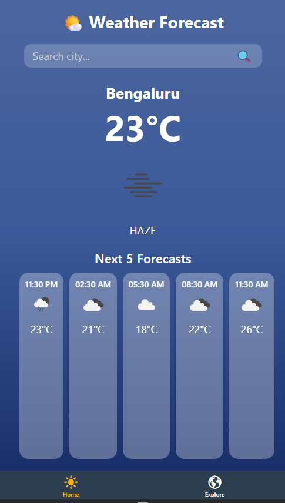
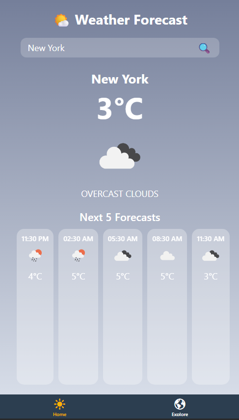
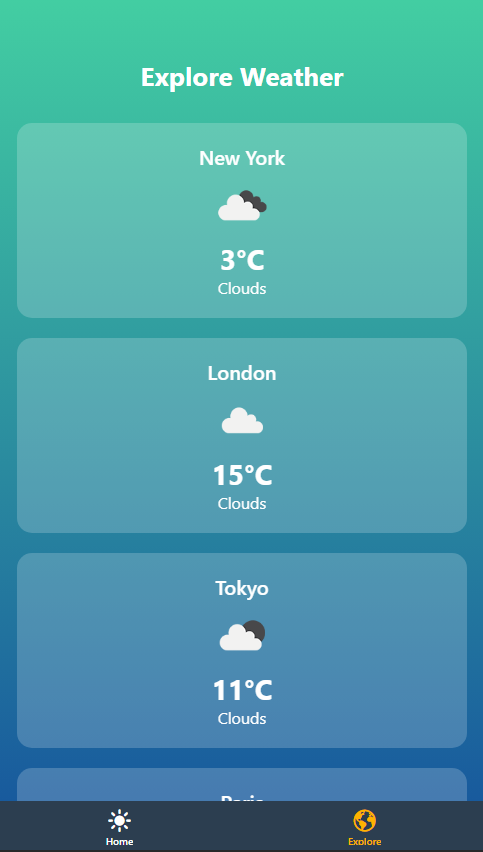

# Weather Forecast — Expo (React Native)

A modern and visually appealing **Weather Forecast App** built using **Expo Router** and **React Native**.  
It provides current weather, a 10-day forecast, dynamic gradient backgrounds based on conditions, and an explore tab with weather info from cities around the world.

---

## 🌤️ Screenshots

- **Home Screen (Search + Current Weather)**  
  

- **10-Day Forecast View**  
  

- **Explore (Multiple Cities)**  
  

---

## ✨ Features

- 🔍 Search any city and view real-time weather data  
- 🌈 Dynamic gradient backgrounds depending on weather type  
- 🗓️ 10-day forecast directly on the home page  
- 🏙️ Explore tab showing live weather for popular cities  
- 🧭 Tab navigation via **Expo Router**  
- 🔒 Environment variables using `.env` for API key protection  

---

## 🛠️ Tech Stack

- **Expo (React Native Framework)**
- **Expo Router**
- **TypeScript**
- **OpenWeather API**
- **expo-linear-gradient**
- **@env (react-native-dotenv)**

---

## 📁 Project Structure

app/
├─ (tabs)/
│ ├─ _layout.tsx # Tab layout (Home + Explore)
│ ├─ index.tsx # Home / 10-day Forecast
│ └─ explore.tsx # Explore page with multiple cities
assets/
└─ screenshots/
├─ home.png
├─ forecast.png
└─ explore.png
.env.example
README.md
LICENSE

yaml
Copy code

---

## 🚀 Getting Started

### 1️⃣ Clone the repository

git clone https://github.com/<your-username>/<repo-name>.git
cd <repo-name>
### 2️⃣ Install dependencies
  
  npm install
  #  or
  yarn

### 3️⃣ Create a .env file
  Use the example file as reference:

  cp .env.example .env

  Then add your OpenWeather API key:

  WEATHER_API_KEY=your_openweather_api_key_here
### 4️⃣ Start the app

  npx expo start
  Run it on your phone using the Expo Go app or an emulator.

## 🌦️ Environment Variables
This project uses react-native-dotenv to safely manage API keys.

Example:

ts
Copy code
import { WEATHER_API_KEY } from '@env';
const API_KEY = WEATHER_API_KEY;
.env.example
env
Copy code
WEATHER_API_KEY=your_openweather_api_key_here
⚠️ Make sure .env is listed in .gitignore to prevent leaks!

## 🎨 Dynamic Background Logic
Each weather condition has its own color palette:

Weather	Gradient
Clear	['#FFD700', '#FF8C00']
Clouds	['#757F9A', '#D7DDE8']
Rain / Thunderstorm	['#314755', '#26a0da']
Snow	['#83a4d4', '#b6fbff']
Mist / Fog	['#606c88', '#3f4c6b']

This is handled via a helper in index.tsx to keep visuals adaptive.

📜 License
This project is licensed under the MIT License — see the LICENSE file for details.

👤 Author
Alaric Sequeira

---

## 📄 `LICENSE` (MIT License)
